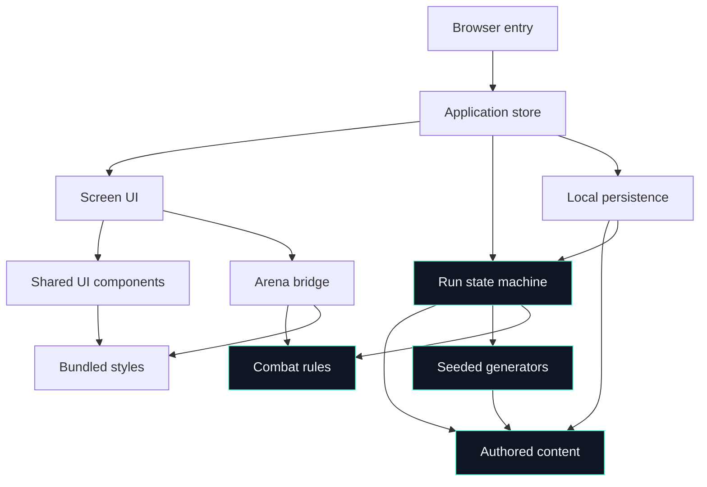

# Architecture — SHARDBREAK

## Stack Decision

| Layer | Technology | Rationale |
|-------|-----------|-----------|
| Language | TypeScript 5.x, strict mode, ES2022 target | Typed content definitions, discriminated run states, and validated save envelopes reduce errors in a deterministic rules engine. ES2022 supplies the browser features needed by the client without a transpiled server runtime. |
| Framework | React 19, client-only | React is used for the staged screens, accessible controls, and responsive shell. The real-time arena remains an isolated Canvas component rather than forcing the game loop through React renders. |
| UI Framework | Semantic React DOM, CSS custom properties, and bundled CSS | The design depends on semantic labels, focus states, responsive layout, and reduced-motion rules. CSS is bundled with the app; the CDN/Tailwind usage in the mocks is not a production dependency. |
| State Management | Custom external application store using `useSyncExternalStore` plus pure domain reducers | A small command store keeps the run state machine explicit, testable, and independent of component lifecycles. React observes state but never becomes the authority for gameplay or persistence. |
| Database | Browser IndexedDB | It is available on the target browsers, supports structured local data and multi-store transactions, and is appropriate for a serverless profile plus one living run. |
| ORM / Data Layer | `idb` typed adapter plus Zod runtime schemas | `idb` removes IndexedDB event boilerplate without hiding transactions. Zod validators treat saved and imported data as untrusted input before it reaches domain logic. No relational ORM is needed. |
| Build Tool | Vite 7 with TypeScript and React plugins | Vite produces a fast static bundle suitable for GitHub Pages, has no server runtime requirement, and supports the Canvas/DOM split cleanly. |
| Test Framework | Vitest, React Testing Library, and Playwright | Pure reducers, deterministic generators, and persistence adapters are fast to test with Vitest; accessible screen behavior uses Testing Library; critical pointer, refresh, responsive, and import/export flows use Playwright. |
| Deployment Target | GitHub Pages through GitHub Actions | The product is a static site. A production build is uploaded as static assets, with the repository base path supplied to Vite and no runtime gameplay service. |

## Alternatives Considered

| Decision | Chosen | Rejected | Why |
|----------|--------|----------|-----|
| Application framework | React + Vite | Next.js, a server-rendered framework | SHARDBREAK has no server-side data, authentication, or runtime API. React gives the screen composition and accessibility model needed without adding server routing or deployment complexity. |
| Arena renderer | Custom Canvas 2D with DOM overlays | Phaser, PixiJS, SVG/DOM-only rendering | The bounded brick-breaker field needs a small fixed-step simulation and direct pointer coordinates, not a full scene-graph framework. Canvas keeps the loop predictable; DOM overlays keep essential text and controls accessible. |
| State management | Custom command store + pure reducers | Redux Toolkit, Zustand, component-local state | The initial game has one authoritative state machine. A small store avoids a second abstraction while still providing subscriptions, serializable transitions, and a single persistence boundary. Component-local state would make refresh-safe commits and idempotency harder. |
| Local persistence | IndexedDB via `idb` | `localStorage`, SQLite/WASM, hosted database | IndexedDB is asynchronous and transactional, has more room for structured run state, and is built into the target browsers. `localStorage` is synchronous and lacks transactions; SQLite/WASM and a hosted database add weight or violate local-only delivery. |
| Runtime validation | Versioned schemas at the persistence boundary | Trusting TypeScript types, deserializing arbitrary JSON | TypeScript types disappear at runtime. Schema validation and content-ID checks are required for malformed imports, old saves, and manually edited local data. |
| Randomness | Seed-derived deterministic streams with persisted event keys | `Math.random()`, a server RNG, hidden rerolls | A fixed run seed makes routes, rooms, rewards, and shops reproducible without a network. Named event keys prevent an unrelated random draw from changing a later reward. |
| Styling | Bundled CSS using the design tokens | Runtime Tailwind CDN, CSS-in-JS | Static CSS avoids a network dependency after load, keeps the GitHub Pages build self-contained, and makes the responsive and reduced-motion contract easy to audit. |

## Module Structure

The application is a client-only monolith. Paths below are intentionally
explicit because they are the ownership boundaries used by implementation and
later session planning.

```text
./src/
├── main.tsx                                      — browser entry and dependency wiring
├── app/
│   ├── App.tsx                                   — top-level screen composition
│   ├── appStore.ts                               — application state, commands, subscriptions
│   ├── commands.ts                               — UI/game command types and dispatch boundary
│   └── navigation.ts                             — screen derivation and safe navigation
├── domain/
│   ├── content/
│   │   ├── catalog.ts                            — immutable versioned catalog facade
│   │   ├── classes.ts                            — class definitions and starting profiles
│   │   ├── skills.ts                             — active skill definitions
│   │   ├── equipment.ts                          — passive equipment definitions
│   │   ├── enemies.ts                             — ordinary enemy and formation definitions
│   │   ├── bosses.ts                              — boss archetypes and compatible modifiers
│   │   ├── rooms.ts                               — room archetypes and route metadata
│   │   ├── enhancements.ts                       — enhancement definitions and compatibility
│   │   └── relics.ts                              — bounded carry-over relic definitions
│   ├── random/
│   │   ├── seededRng.ts                           — seed derivation and deterministic draws
│   │   └── generators.ts                          — routes, rooms, shops, rewards, and threats
│   ├── combat/
│   │   ├── model.ts                               — arena, actor, projectile, hazard, and boss types
│   │   ├── rules.ts                               — fixed-step combat transitions and collisions
│   │   ├── bossState.ts                           — phase transitions, telegraphs, and counters
│   │   └── results.ts                             — validated combat outcomes and event IDs
│   └── run/
│       ├── model.ts                               — profile, living-run, build, route, and summary types
│       ├── reducer.ts                             — pure run state-machine transitions
│       ├── commands.ts                            — start, route, room, reward, and terminal actions
│       ├── routes.ts                              — floor and mandatory-boss progression rules
│       ├── rewards.ts                             — three-card draft and one-time selection rules
│       ├── threat.ts                              — cycle budget and sublinear scaling policy
│       ├── progression.ts                         — Shards, records, unlocks, and relic effects
│       └── validation.ts                          — domain invariants and transition guards
├── game/
│   ├── Arena.tsx                                  — Canvas host plus accessible arena controls
│   ├── engine.ts                                  — requestAnimationFrame loop and fixed timestep
│   ├── input.ts                                   — mouse, trackpad, touch, and keyboard launch input
│   ├── renderer.ts                                — Canvas drawing, scaling, and reduced-motion effects
│   └── session.ts                                 — ephemeral live-room session and outcome bridge
├── persistence/
│   ├── database.ts                               — IndexedDB connection and schema versioning
│   ├── repositories.ts                            — profile/living-run reads and atomic writes
│   ├── envelopes.ts                               — persisted envelope and revision types
│   ├── validation.ts                              — runtime save/import validation and migration guards
│   └── transfer.ts                                — permanent-profile export and import pipeline
├── ui/
│   ├── screens/
│   │   ├── HomeScreen.tsx                         — launch archive and no-overwrite guard
│   │   ├── RouteMapScreen.tsx                     — route comparison and commitment
│   │   ├── CombatScreen.tsx                       — ordinary battle room shell
│   │   ├── BossScreen.tsx                         — boss identity, phase, and telegraph shell
│   │   ├── RewardsScreen.tsx                      — exactly-three-card reward draft
│   │   ├── RunSummaryScreen.tsx                   — terminal summary and relic choice
│   │   └── ProfileScreen.tsx                      — local archive, unlocks, and transfer
│   └── components/
│       ├── AppStatusBar.tsx                       — product, depth, profile, and save state
│       ├── RouteCard.tsx                           — visible route risk/reward choice
│       ├── RewardCard.tsx                          — fully revealed single-choice reward
│       ├── IntegrityMeter.tsx                      — pips plus text survivability status
│       ├── SkillRail.tsx                           — three active skill slots and charges
│       ├── TelegraphBanner.tsx                     — named warning, timer, and counterplay
│       ├── ConfirmationDialog.tsx                  — abandon, reset, and destructive decisions
│       ├── SaveSignal.tsx                          — saved/rejected/warning feedback
│       └── TransferPanel.tsx                       — export, import, validation, and reset UI
└── styles/
    ├── tokens.css                                 — palette, spacing, typography, and glow tokens
    ├── global.css                                 — semantic controls, focus, and base surfaces
    └── responsive.css                             — desktop, tablet, phone, and reduced-motion rules
```

## Module Contracts

### M01 — `./src/main.tsx` and `./src/app/`

- **Owns:** Bootstrapping React, loading the local profile/run, constructing the application store, deriving the current screen, and exposing one command dispatch boundary to UI and game code.
- **Exports:** `App`, `AppStore`, `AppState`, `dispatch(command)`, `subscribe(listener)`, and `getSnapshot()`.
- **Depends on:** `./src/domain/run/`, `./src/persistence/`, and the screen modules under `./src/ui/screens/`.
- **Key types:** `AppState`, `AppCommand`, `ScreenId`, `SaveSignal`, `LoadStatus`.
- **Contract:** Components may dispatch commands and read snapshots; they may not mutate a run object or call IndexedDB directly. The store applies a pure domain transition first, persists a committed checkpoint, then publishes the new state and save signal.

### M02 — `./src/domain/content/`

- **Owns:** The finite authored catalog and its compatibility metadata. Definitions are immutable and bundled with the application; no content is fetched during a run.
- **Exports:** `ContentCatalog`, `ContentVersion`, `ClassDefinition`, `SkillDefinition`, `EquipmentDefinition`, `EnemyDefinition`, `BossDefinition`, `RoomDefinition`, `EnhancementDefinition`, `RelicDefinition`, and lookup helpers.
- **Depends on:** Shared TypeScript primitives only.
- **Key types:** `ContentId`, `ContentAvailability`, `CompatibilityRule`, `TelegraphDefinition`, `EffectDefinition`.
- **Contract:** Every referenced ID is present in the catalog. Definitions contain the data needed for compatibility, depth/cycle availability, visible effects, costs, trade-offs, telegraphs, and rendering keys; they do not contain UI components or mutable run state.

### M03 — `./src/domain/random/`

- **Owns:** Reproducible randomness for one run and the generation of deterministic route, room, shop, reward, and threat candidates.
- **Exports:** `RunSeed`, `deriveStream(seed, contentVersion, eventKey)`, `SeededRng`, `generateRouteOptions()`, `generateRewardDraft()`, `generateShopInventory()`, and `generateThreatProfile()`.
- **Depends on:** `./src/domain/content/`.
- **Key types:** `EventKey`, `RngCursor`, `RouteOffer`, `RewardDraft`, `ShopInventory`, `ThreatProfile`.
- **Contract:** No generator reads wall-clock time or calls `Math.random()`. Event keys include the run seed, content version, depth/cycle, room identity, and event type. Generated offers are persisted when committed or when a choice screen opens, so refresh cannot reroll an event.

### M04 — `./src/domain/combat/`

- **Owns:** The deterministic combat model: arena coordinates, paddle and ball rules, collision resolution, enemy behavior, hazards, boss phases, telegraphs, and conversion of simulation events into validated outcomes.
- **Exports:** `CombatState`, `CombatCommand`, `advanceCombat()`, `createCombatState()`, `BossPhaseState`, `TelegraphState`, and `CombatOutcome`.
- **Depends on:** `./src/domain/content/` and `./src/domain/random/` for room initialization; no UI or persistence modules.
- **Key types:** `WorldPoint`, `PaddleState`, `BallState`, `EnemyState`, `HazardState`, `CombatEvent`, `OutcomeId`.
- **Contract:** The simulation advances with a fixed timestep and resolves collisions consistently at supported frame rates. High-impact events carry an `OutcomeId` and room identity; the run reducer accepts each outcome at most once. Combat exposes labels and counterplay data for DOM telegraphs in addition to render data.

### M05 — `./src/domain/run/`

- **Owns:** The authoritative application state machine for profiles and living runs: class/build limits, floors, routes, rooms, rewards, shops, recovery, Integrity, terminal outcomes, records, Shards, unlocks, and relic selection.
- **Exports:** `Profile`, `LivingRun`, `RunPhase`, `RunCommand`, `RunTransition`, `runReducer()`, `validateRunCommand()`, `calculateShards()`, and `calculateRecordUpdate()`.
- **Depends on:** `./src/domain/content/`, `./src/domain/random/`, and `./src/domain/combat/`. It does not depend on React, Canvas, or IndexedDB.
- **Key types:** `RunState`, `BuildState`, `RouteState`, `RoomState`, `RewardDraft`, `RunSummary`, `TerminalState`, `ProfileState`.
- **Contract:** All meaningful state changes go through commands and pure transitions. The reducer enforces one living run, initial depth 1, mandatory `depth % 3 === 0` boss floors, exactly three reward cards, one selected card, maximum three active skills, maximum four passive equipment items, bounded recovery, legal compatibility, and non-negative charges/currency. A committed transition carries a persistence instruction and idempotency key.
- **Record rule:** `highestReachedDepth` is the greatest numbered floor entered by a valid run checkpoint, including a boss floor reached before death. It is updated only on a committed floor entry and is never derived from an uncommitted frame.

### M06 — `./src/game/`

- **Owns:** The real-time browser bridge: Canvas sizing and drawing, pointer coordinate normalization, the fixed-step animation loop, ephemeral live combat state, and conversion of engine outcomes into application commands.
- **Exports:** `Arena`, `GameSession`, `createGameSession()`, `PointerInput`, and `RenderSnapshot`.
- **Depends on:** `./src/domain/combat/` for rules/types and `./src/app/commands.ts` for the outcome bridge. It may read an app snapshot but never writes persistence directly.
- **Key types:** `CanvasViewport`, `PointerIntent`, `FrameClock`, `GameOutcomeMessage`.
- **Contract:** The engine uses `requestAnimationFrame` only as a clock and advances simulation in a fixed timestep with a bounded accumulator. The Canvas is scaled for device pixel ratio and maps pointer/touch coordinates into a stable world space. Launch is an explicit button/pointer action; pointer movement alone only aims or moves the paddle. Essential status, telegraphs, and controls are DOM-accessible siblings rather than Canvas-only text.
- **Checkpoint rule:** Frame-by-frame physics is ephemeral. The app persists a safe pre-launch/loss-of-ball checkpoint and meaningful committed actions such as skill use or room clear; a refresh during an uncommitted live volley resumes from the latest valid checkpoint rather than inventing a new result.

### M07 — `./src/persistence/`

- **Owns:** IndexedDB schema connection, profile and living-run repositories, atomic transaction boundaries, revision handling, runtime validation, and permanent-profile transfer.
- **Exports:** `openDatabase()`, `loadProfile()`, `loadLivingRun()`, `saveCheckpoint()`, `finalizeRunAtomically()`, `abandonRunAtomically()`, `exportProfile()`, `validateImport()`, `importProfileAtomically()`, and `resetProfileAtomically()`.
- **Depends on:** `./src/domain/content/` for known-ID validation and `./src/domain/run/` persistence types. It does not import React or game code.
- **Key types:** `ProfileEnvelope`, `LivingRunEnvelope`, `SaveRevision`, `SaveSchemaVersion`, `ImportResult`, `PersistenceError`.
- **Contract:** The database has one current profile record and at most one current living-run record. A checkpoint uses one IndexedDB read/write transaction and a monotonically increasing revision. Terminal finalization updates profile rewards/records and deletes the living-run record in the same transaction. An invalid save or import is rejected before any write; import replaces only permanent profile data and never includes or rewrites active living-run state.
- **Transfer rule:** Exported data is a versioned canonical JSON payload containing profile progression only. It includes a best-effort SHA-256 integrity digest for accidental tampering detection, but local records are never treated as authoritative competitive scores.

### M08 — `./src/ui/screens/`

- **Owns:** Screen-level composition and user flows for the seven design screens: launch archive, route map, battle, boss, reward draft, terminal summary, and local profile.
- **Exports:** `HomeScreen`, `RouteMapScreen`, `CombatScreen`, `BossScreen`, `RewardsScreen`, `RunSummaryScreen`, and `ProfileScreen`.
- **Depends on:** `./src/app/`, `./src/ui/components/`, and `./src/game/Arena.tsx` where applicable. Screens do not access domain reducers or IndexedDB directly.
- **Key types:** Screen view models derived from `AppState`, `ScreenAction`, and `AccessibleChoiceState`.
- **Contract:** Screens render the current snapshot and dispatch commands. Route and reward choices are single-choice controls with visible selected/unavailable/resolved states. Destructive actions use `ConfirmationDialog`; no screen can start a new run while a living run exists without an explicit resume, abandon, or cancel choice.

### M09 — `./src/ui/components/`

- **Owns:** Reusable accessible controls and state indicators shared by screens, including status bar, route/reward cards, Integrity meter, skill rail, telegraph, confirmations, save signal, and transfer panel.
- **Exports:** The component files named in the module tree, each with semantic props and controlled state.
- **Depends on:** `./src/styles/` and typed view-model props from `./src/app/`; it does not own state transitions.
- **Key types:** `RouteCardProps`, `RewardCardProps`, `IntegrityMeterProps`, `TelegraphProps`, `ConfirmationDialogProps`, and `TransferPanelProps`.
- **Contract:** Important state is communicated through text, labels, icons/patterns, and borders in addition to color. Controls have visible focus, a minimum 44px target where actionable, meaningful names, and disabled reasons when relevant. Reduced motion changes decoration only; it never hides a warning or changes a rule.

### M10 — `./src/styles/`

- **Owns:** Design tokens and responsive presentation rules: palette, typography, spacing, surface treatment, focus rings, desktop/tablet/phone breakpoints, and `prefers-reduced-motion` overrides.
- **Exports:** Bundled CSS imported by `./src/main.tsx` and token custom properties consumed by UI and Canvas rendering.
- **Depends on:** No application modules.
- **Key types:** None; the contract is the token and class naming surface.
- **Contract:** The CSS preserves the design's desktop 12-column relationship, tablet arena/rail fallback, phone single-column order, stable arena aspect ratio, and non-color-only state treatment. No production screen relies on a CDN stylesheet.

## Data Flow

### Startup and screen flow

1. `./src/main.tsx` opens IndexedDB through `./src/persistence/database.ts` and loads the validated profile plus optional living run.
2. `./src/app/appStore.ts` derives `ScreenId` from the loaded run phase and publishes loading, recovery, or validation feedback.
3. A screen in `./src/ui/screens/` renders a view model and dispatches a typed command; it never mutates state or writes a save itself.
4. The app store calls `runReducer()` with the command and the current snapshot. The reducer returns either a rejected transition or a new state plus an idempotent persistence instruction.
5. The persistence repository commits the instruction transactionally. Only after success does the store publish the new snapshot and `SaveSignal`.

### Combat flow

1. Entering a battle or boss room creates a deterministic `RoomState` from the fixed run seed, depth, content version, threat profile, and room event key.
2. `./src/game/session.ts` creates an ephemeral combat session from that room state. `./src/game/engine.ts` advances `advanceCombat()` at a fixed timestep while `./src/game/input.ts` supplies normalized pointer intent.
3. `./src/game/Arena.tsx` renders the field in Canvas and renders the named objective, Integrity, skill controls, and telegraphs in the DOM.
4. Launch, skill use, ball loss, boss phase change, and room clear become typed app commands. The reducer validates room identity, outcome ID, current phase, and available charges before committing effects.
5. A ball loss applies exactly one Integrity damage and returns the room to a valid pre-launch checkpoint if Integrity remains. At zero Integrity, `finalizeRunAtomically()` updates the profile summary/record/Shards and removes the living run in one transaction.

### Route, reward, and progression flow

1. `./src/domain/random/generators.ts` derives route offers from `(runSeed, contentVersion, depth, routeEventKey)`; the route module forces a boss room for every multiple of three.
2. Entering a reward phase derives exactly three fully revealed cards from a reward event key. The draft, card IDs, rolled enhancements, and compatibility decisions are stored in `LivingRun` before selection.
3. A single `SelectReward` command records the selected card and a one-time selection key. Repeating the command is rejected as already committed.
4. Shop inventory, prices, recovery effect, and route state are similarly stored before commitment, so refreshes cannot reroll or repeat them.
5. Terminal finalization calculates visible deterministic Shards and a local record update. A bounded relic choice is stored in profile state and can be committed after the living run has already been deleted.

## Dependency Flow



The intended import direction is inward toward pure domain modules. `./src/domain/`
does not import `./src/ui/`, `./src/game/`, or `./src/persistence/`. The app
store is the only orchestration point joining domain transitions to persistence
and presentation.

## API Design

There is **no HTTP API** and no runtime gameplay request. GitHub Pages serves
the built assets only. The application boundary is a typed local command API:

| Command family | Method / event | Purpose | Durable result |
|----------------|----------------|---------|----------------|
| Run lifecycle | `startRun`, `resumeRun`, `abandonRun` | Create, recover, or explicitly replace the one living run | Profile and/or living-run transaction |
| Route | `selectRoute`, `enterRoom` | Commit one visible route and materialize its room | Living-run checkpoint |
| Combat | `launch`, `useSkill`, `applyCombatOutcome` | Control the arena and commit validated loss/clear/boss events | Living-run checkpoint or terminal finalization |
| Reward | `selectReward`, `confirmReward` | Select exactly one revealed card and apply it once | Living-run checkpoint |
| Utility rooms | `buyShopItem`, `commitRecovery` | Apply a visible cost/effect once | Living-run checkpoint |
| Terminal | `chooseRelic`, `dismissSummary` | Commit bounded carry-over choice and leave terminal state | Profile transaction |
| Transfer | `exportProfile`, `importProfile`, `resetProfile` | Move or explicitly erase permanent local progression | Profile transaction; living run excluded |

Commands are serializable for testing, but live Canvas frames are not persisted
as commands. Every durable command includes the expected run revision and an
event/commit ID so duplicate clicks, retries, and refresh recovery cannot apply
the same reward, purchase, recovery, damage, or room completion twice.

## Security Posture

- **Authentication:** None. The product intentionally has one local browser profile and no account identity.
- **Authorization:** No multi-user authorization is needed. Domain guards enforce legal class/content IDs, phase transitions, slot limits, costs, compatibility, and profile ownership of unlocks.
- **Data at rest:** Browser-managed IndexedDB containing gameplay state only; no sensitive personal data is collected. The app does not claim that local records are tamper-proof.
- **Data in transit:** GitHub Pages is served over HTTPS. After the static bundle is loaded, a run does not require network access or a proprietary external service.
- **Untrusted data:** Imported JSON and stored records are size-limited, parsed without evaluation, validated against versioned schemas, checked for legal ranges and known IDs, and rejected before any transaction. Imported values never become URLs, code, or network requests.
- **Integrity limits:** A canonical payload digest detects accidental corruption or ordinary edit mismatch, but a client-only checksum cannot prevent a determined user from changing a local record. Records remain personal, not competitive or authoritative.

## Deployment Architecture

- **Target:** A GitHub Pages project site containing the Vite `./dist` output.
- **Build:** `npm ci` followed by `npm run build`; Vite receives the repository base path so asset and client navigation URLs work under a project-site prefix.
- **Runtime:** One browser tab runs the React shell, the Canvas fixed-step session, and the IndexedDB repository. All catalog definitions, fonts/fallbacks, styles, and game code required for a run ship in the bundle.
- **Persistence:** IndexedDB is scoped to the deployed origin. Export/import is the supported cross-browser/device transfer path; active living-run state is deliberately excluded from exports.
- **Release safety:** `contentVersion` and `saveSchemaVersion` are embedded in the bundle. Compatible changes migrate or validate explicitly; incompatible imported data is rejected with a user-readable reason. A deployment must not silently reinterpret an existing committed reward or route.
- **Performance boundary:** React renders screen and state changes; Canvas owns the 60fps loop. Persistence runs asynchronously at durable checkpoints and never blocks a frame or hides a route/reward transition behind a network request.

## Open Architectural Questions

- Exact collision tolerances, ball speed, and fixed-timestep values need playtesting; they are isolated in `./src/domain/combat/rules.ts` and do not change the module boundaries.
- Exact threat-budget coefficients, content counts, reward weights, and boss modifier caps need balance passes; they belong in the versioned catalog and generator policy, not in UI code.
- The final asset/font licensing set is still a production-content decision. The architecture assumes local bundled assets with system-font fallbacks and no runtime asset service.
