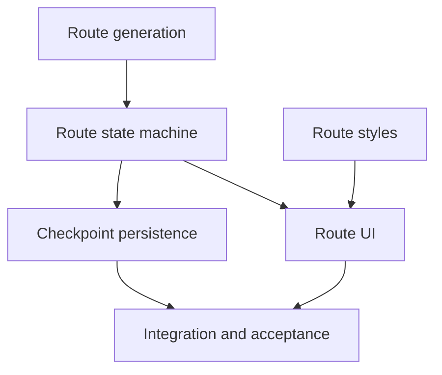

# State Tracker — SHARDBREAK / deterministic-routes-and-utility-rooms

## Program / Feature / Intent / Sessions

- **Program:** SHARDBREAK (`shardbreak`)
- **Feature:** `deterministic-routes-and-utility-rooms`
- **Intent:** Turn the lifecycle feature's safe empty depth-1 checkpoint into a
  deterministic, refresh-stable Route Map; commit selected rooms atomically;
  resolve bounded Shop and Recovery rooms once; advance floors with mandatory
  Boss routing at every third depth; and expose the complete accessible flow
  without fabricating combat or rewards.
- **Sessions:** 6
- **Checkpoints:** 20
- **Source authority:** `./program/shardbreak/FORGE-CONFIG.md`, Genesis
  specifications/mocks under `./program/shardbreak/specs/` and
  `./program/shardbreak/mocks/`, current source, and module details under
  `./program/shardbreak/arch/`.
- **Verified baseline:** `npm run verify` exited 0 on 2026-08-30 with 8 test
  files and 156 tests passing; the production Vite build completed. Git history
  contains all four SESSION-06 lifecycle integration checkpoints and both
  SESSION-07 delivery checkpoints even though the older
  `./program/shardbreak/prompts/run-lifecycle-foundation/STATE.md` still has a
  stale pending row for SESSION-06. This plan follows the implemented source
  and git history, not that stale row.

## Session Status

| # | Session | Modules | Owns | Status | Checkpoint | Completed | Notes |
|---|---------|---------|------|--------|------------|-----------|-------|
| 01 | Author Seeded Route and Utility Generation | M02, M03 | `./src/domain/content/catalog.ts`, `./src/domain/content/catalog.test.ts`, `./src/domain/content/rooms.ts`, `./src/domain/content/rooms.test.ts`, `./src/domain/content/bosses.ts`, `./src/domain/random/seededRng.ts`, `./src/domain/random/seededRng.test.ts`, `./src/domain/random/generators.ts`, `./src/domain/random/generators.test.ts` | blocked | — | 2026-08-30 | no handoff JSON; see `./.forge/results/SESSION-01.result.md` |
| 02 | Commit Routes and Resolve Utility Rooms | M05 | `./src/domain/run/model.ts`, `./src/domain/run/routes.ts`, `./src/domain/run/commands.ts`, `./src/domain/run/validation.ts`, `./src/domain/run/reducer.ts`, `./src/domain/run/routeUtility.test.ts` | pending | — | — | — |
| 03 | Persist Route and Utility Checkpoints Atomically | M07 | `./src/persistence/envelopes.ts`, `./src/persistence/validation.ts`, `./src/persistence/validation.test.ts`, `./src/persistence/repositories.ts`, `./src/persistence/repositories.test.ts` | pending | — | — | — |
| 04 | Extend the Tactical Route Presentation | M10 | `./src/styles/global.css`, `./src/styles/responsive.css` | pending | — | — | — |
| 05 | Build the Accessible Route and Utility Screen | M08, M09 | `./src/ui/components/RouteCard.tsx`, `./src/ui/components/RouteCard.test.tsx`, `./src/ui/screens/RouteMapScreen.tsx`, `./src/ui/screens/RouteMapScreen.test.tsx` | pending | — | — | — |
| 06 | Integrate and Prove Durable Route Navigation | M01, M13 | `./src/app/commands.ts`, `./src/app/navigation.ts`, `./src/app/appStore.ts`, `./src/app/appStore.test.ts`, `./src/app/App.tsx`, `./src/app/App.test.tsx`, `./tests/e2e/indexedDb.ts`, `./tests/e2e/run-lifecycle.spec.ts`, `./tests/e2e/route-utility.spec.ts` | pending | — | — | — |

Statuses: `pending` | `in-progress` | `done` | `blocked` | `skipped`  
Checkpoint is the last committed checkpoint number, or `—`.

## Wave Plan

| Wave | Sessions | Why concurrent |
|------|----------|----------------|
| 1 | SESSION-01, SESSION-04 | Content/random generation and Route Map CSS have literally disjoint leases and read only the completed baseline/specs. |
| 2 | SESSION-02 | Single domain gate: it consumes SESSION-01's generated candidate API and publishes the route/utility transition artifact required by persistence and UI projection. |
| 3 | SESSION-03, SESSION-05 | M07 checkpoint persistence and M08/M09 controlled presentation both consume M05 contracts but write disjoint persistence versus UI paths; SESSION-05 also consumes completed SESSION-04 CSS. |
| 4 | SESSION-06 | Single final integration/acceptance context: it joins repository and screen artifacts, then updates browser acceptance in later checkpoints instead of creating a forbidden verification-only session. |

## Dependency Graph

## Architecture Reference

- **Compatibility boundary:** Existing living runs may contain exactly one
  canonical empty depth-1 route. Resume materializes it once and commits before
  display. New routes created after floor advancement are materialized in the
  same transition. No IndexedDB or save-schema migration is required.
- **Determinism:** M03 derives named streams from stored seed, `content-1`, and
  stable event keys. Route, threat, Shop, Recovery, and boss-routing candidates
  never use wall-clock time, `Math.random()`, browser state, or a global cursor.
- **Dependency direction:** M03 imports M02 only. M05 consumes candidates and
  owns phase legality. M07 validates/persists proposed checkpoints. M01 alone
  joins reducers, repository, and controlled M08/M09 presentation.
- **Persistence:** Route materialization, room entry, and purchase update the
  living-run singleton. Utility floor advancement may update both the profile
  reached-depth record and living run in one transaction. Expected revision,
  run ID, operation, and commit ID prevent duplicates.
- **Navigation:** Startup/reload opens Home. Start/Resume enters run navigation
  only after any needed materialization commit. Route/room identity derives the
  Route Map mode; screens cannot set phase directly.
- **Presentation:** `./program/shardbreak/mocks/route-map.html` is the visual
  hierarchy contract. Production uses semantic React and bundled CSS, with
  keyboard radio selection, visible disabled reasons, 44px actions, phone
  stacking, and reduced-motion state parity.
- **Immutable migration:** `./src/migrations/001_initial.ts` is read-only and is
  outside every session lease.

## Scope Summary

| ID | Module | Scope in this feature |
|----|--------|-----------------------|
| M01 | Application shell and command store | Route/utility intent union, ephemeral route selection, legacy materialization, serialized durable commands, derived navigation, view-model composition, and partial-failure truth. |
| M02 | Authored content catalog | Five route categories, bounded Shop/Recovery services, route-support IDs, and the four boss routing identities; no combat/reward mechanics. |
| M03 | Deterministic random generation | Stable RNG, route offers, sublinear threat, Shop inventory/prices, Recovery candidate, room candidates, and boss identity selection. |
| M05 | Run/profile state machine | Route/utility commands, validation, materialization, room entry, purchases, Recovery, safe floor advance, record update, boss scheduling, and idempotent persistence intent. |
| M07 | Persistence | Strict route/room/utility validation plus living-only and profile-plus-living atomic checkpoint writes. |
| M08 | Screen compositions | Route comparison, Shop, Recovery, and truthful durable Battle/Elite/Boss receipt modes. |
| M09 | Shared accessible components | Controlled RouteCard with full visible risk/reward/cost/counterplay and selection/availability semantics. |
| M10 | Design system and responsive styles | Route/path/card/utility styles, phone/tablet reflow, non-color states, and reduced-motion closure. |
| M11 | Genesis migrations | Read-only dependency; no write session or structural schema change. |
| M13 | Browser acceptance tests | Updated lifecycle expectations plus deterministic refresh, selection, utility, Boss lock, responsive, reduced-motion, and base-path coverage. |

### Explicitly Deferred

- Fixed-step combat, Canvas/input/renderer/session bridge, enemy behavior,
  ball-loss outcomes, and Battle/Elite room completion.
- Boss phases, attacks, telegraphs, compatible modifiers, defeat, and boss
  rewards; this feature adds only stable routing identities and a saved arrival
  receipt.
- Skills, equipment, enhancements, exactly-three reward drafts, capacity/
  replacement, and reward selection.
- Terminal finalization, Shards awards, relic choice, unlocks, Profile screen,
  export/import/reset, and release-wide performance hardening.

## Design Decisions

| Choice | Rationale |
|--------|-----------|
| Treat “the next set of features” as the recommended **Deterministic routes and utility rooms** feature | It is item 2 in the confirmed `./program/shardbreak/FORGE-CONFIG.md` sequence and directly consumes the completed lifecycle boundary. |
| Preserve `content-1`, database version 1, and save schema 1 | Existing document shapes already contain routes, rooms, Shop, Recovery, threat, and boss state; structural migration would be unnecessary and DB-owned. |
| Lazily materialize the existing empty depth-1 checkpoint | It is the explicit handoff from the first feature and provides a safe migration path for already-created living runs without rerolling or overwriting them. |
| Keep lifecycle and route reducer result types source-compatible until M01 integration | The current exhaustive lifecycle store must continue compiling at every session checkpoint; route-specific pure types avoid a broken intermediate tree. |
| Use one authored room per required category for this slice | The design compares Battle, Elite, Shop, and Recovery in stable order; seeded threat, hazards, prices, inventory order, and boss identity provide deterministic variation without hidden card semantics. |
| Limit initial Shop services to run-currency-for-bounded-Integrity repair | Skills/equipment arrive in the next feature. This gives Shop a real, capped, non-permanent effect without inventing future build contracts. |
| Keep route card selection ephemeral and commit on Enter | Offers themselves are persisted before display; a local selection causes no write, while Enter atomically saves the selected materialized room before navigation. |
| Advance directly from resolved utility room to a materialized next route | One atomic checkpoint prevents re-entry/repeat, keeps no unbounded event log, and makes refresh yield either the utility room or the complete next floor. |
| Stop Battle/Elite/Boss at a truthful durable room receipt | Combat is a later feature. A real saved receipt proves routing without a forbidden mock clear or fabricated reward path. |
| Retain Home as the reload/archive surface | It preserves the one-living-run safety model; Resume re-derives the committed route/room screen and writes only for a legacy empty route. |
| Keep browser tests read-only apart from database deletion for isolation | Domain/repository tests can construct funded/damaged fixtures; E2E must prove public flows without bypassing transition rules. |

## Handoff Notes

### SESSION-01 — blocked 2026-08-30

- **Checkpoint:** 0/3
- **Reason:** no handoff JSON; see `./.forge/results/SESSION-01.result.md`
