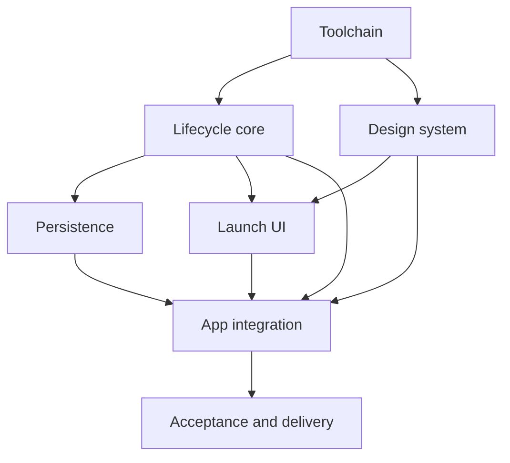

# State Tracker — SHARDBREAK / run-lifecycle-foundation

## Program / Feature / Intent / Sessions

- **Program:** SHARDBREAK (`shardbreak`)
- **Feature:** `run-lifecycle-foundation`
- **Intent:** Deliver the first durable browser slice: strict React/Vite tooling,
  class Integrity and availability, local profile bootstrap, exactly one
  resumable living run, explicit abandon/no-overwrite behavior, the launch
  archive, and static browser delivery.
- **Sessions:** 7
- **Source authority:** `./program/shardbreak/FORGE-CONFIG.md` plus Genesis
  specifications and mocks under `./program/shardbreak/specs/` and
  `./program/shardbreak/mocks/`.

## Session Status

| # | Session | Modules | Owns | Status | Checkpoint | Completed | Notes |
|---|---------|---------|------|--------|------------|-----------|-------|
| 01 | Bootstrap the Verifiable Web Toolchain | M12 | `./package.json`, `./package-lock.json`, `./tsconfig.json`, `./tsconfig.app.json`, `./tsconfig.node.json`, `./vite.config.ts`, `./vitest.config.ts`, `./eslint.config.js`, `./src/vite-env.d.ts`, `./src/test/setup.ts` | done | 2 | 2026-08-29 | Toolchain scaffold locked: npm scripts (dev/lint/typecheck/test:unit/test:e2e/build/verify), TS project refs (strict, ES2022, DOM+IndexedDB), Vite scaffold-safe migration smoke build, Vitest node-default, ESLint flat + embedded Stylelint. npm run verify exits 0. Follow-up: setupFiles=./src/test/setup.ts runs for every suite; it only extends expect (jest-dom matchers) and is node-safe, so SESSION-02's pure Node domain tests are unaffected. Component tests must declare `// @vitest-environment jsdom` per file; persistence tests opt into fake-indexeddb themselves (not globally installed). Deploy (SESSION-07) should set VITE_BASE_PATH to the repo prefix. If a Vite-8-only plugin is needed later, bump Vite in FORGE-CONFIG first. |
| 02 | Define Classes and Pure Run Lifecycle Transitions | M01, M02, M05 | `./src/app/commands.ts`, `./src/domain/content/catalog.ts`, `./src/domain/content/catalog.test.ts`, `./src/domain/content/classes.ts`, `./src/domain/run/model.ts`, `./src/domain/run/routes.ts`, `./src/domain/run/commands.ts`, `./src/domain/run/validation.ts`, `./src/domain/run/reducer.ts`, `./src/domain/run/lifecycle.test.ts` | done | 3 | 2026-08-29 | M02 content catalog (content-1, three classes: Circuit Rogue 3 + Glitch Knight 4 initial, Neon Mage 2 locked), M05 full v1 Profile/LivingRun domain model + depth/cycle routes + cross-field validation + pure StartRun/AbandonRun reducer, and the M01 AppCommand boundary. All pure; no React/browser/persistence/random/time in domain. Follow-up: ContentId/ContentVersion are branded strings defined in content/catalog.ts; authored data casts string literals (`"..." as ContentId`) at the catalog boundary and consumers use lookup helpers. validation.ts currently resolves known-ID checks only against classes (catalog.hasClass) since only classes exist in content-1 — extend when skills/equipment/relics land. RunRejection `invalid-state` carries string issue messages (not ValidationIssue objects) to keep commands.ts free of a validation import. The initial route event key format is `route:{contentVersion}:{runId}:{depth}` (depth pinned to 1 at creation). createInitialLivingRun lives in model.ts and is what SESSION-04 persistence + SESSION-06 store should call. |
| 03 | Establish the Launch Archive Design System | M10 | `./src/styles/tokens.css`, `./src/styles/global.css`, `./src/styles/responsive.css` | done | 2 | 2026-08-29 | M10 launch-archive design system: tokens.css (Genesis palette, 4px scale, structure, glows, focus, type stacks), global.css (reset, neon-glitch field, semantic buttons/status/integrity/save primitives, launch archive + class selector + danger overwrite guard), responsive.css (>=1024 base, <=1023 single-column urgency order, <=720 phone, reduced-motion). All state paired with attribute/shape/text, never color-only. npm run verify exits 0. Follow-up: SESSION-05 consumer notes (also in arch fragment): (1) mount .confirmation-backdrop only while the guard is active — it has no built-in open/closed toggle class; (2) place .living-run-strip before .class-selector inside .launch-panel so phone/tablet urgency order holds; (3) supply visible SELECTED and LOCKED text on .class-card — CSS reinforces with border/shape/aria but does not inject label text; (4) .class-card expects 3 grid columns (icon / name+note / integrity) and .run-loop-steps styles its direct children as cells. Only action-button --primary/--quiet/--danger modifiers exist (no magenta variant); the mock's pink Start-new-run maps to --primary, danger to the abandon guard. |
| 04 | Persist Profile Bootstrap and Living-Run Leases | M07 | `./src/persistence/database.ts`, `./src/persistence/envelopes.ts`, `./src/persistence/validation.ts`, `./src/persistence/validation.test.ts`, `./src/persistence/repositories.ts`, `./src/persistence/repositories.test.ts` | done | 3 | 2026-08-29 | Strict cloning v1 validators, migration-backed database opening, fail-closed bootstrap/load, atomic one-run start, and explicit abandon are complete with stable typed errors. Fake IndexedDB persistence tests pass 43/43; the full unit suite passes 120/120 and `npm run verify` exits 0. |
| 05 | Build the Accessible Launch Archive | M08, M09 | `./src/ui/components/AppStatusBar.tsx`, `./src/ui/components/IntegrityMeter.tsx`, `./src/ui/components/ConfirmationDialog.tsx`, `./src/ui/components/SaveSignal.tsx`, `./src/ui/components/lifecycleComponents.test.tsx`, `./src/ui/screens/HomeScreen.tsx`, `./src/ui/screens/HomeScreen.test.tsx` | done | 3 | 2026-08-29 | Controlled M08/M09 launch archive complete: local status, bounded Integrity, focus-contained overwrite guard, durable save feedback, safe class/start/resume intents, and restored-checkpoint mode. Targeted component/screen tests pass 32/32; full unit suite passes 130/130 and `npm run verify` exits 0. |
| 06 | Integrate the Durable Application Store | M01 | `./index.html`, `./src/main.tsx`, `./src/app/App.tsx`, `./src/app/App.test.tsx`, `./src/app/appStore.ts`, `./src/app/appStore.test.ts`, `./src/app/navigation.ts` | pending | — | — | — |
| 07 | Prove the Browser Flow and Ship Static Delivery | M12, M13 | `./playwright.config.ts`, `./tests/e2e/indexedDb.ts`, `./tests/e2e/run-lifecycle.spec.ts`, `./.github/workflows/deploy.yml` | pending | — | — | — |

Statuses: `pending` | `in-progress` | `done` | `blocked` | `skipped`  
Checkpoint is the last committed checkpoint number, or `—`.

## Wave Plan

| Wave | Sessions | Why concurrent |
|------|----------|----------------|
| 1 | SESSION-01 | Single foundation: every later checkpoint requires the locked dependencies and verification scripts. |
| 2 | SESSION-02, SESSION-03 | Pure lifecycle/content contracts and the CSS design system have literally disjoint leases and depend only on the toolchain. |
| 3 | SESSION-04, SESSION-05 | Persistence consumes lifecycle contracts while the launch UI consumes lifecycle/style contracts; their M07 and M08/M09 write sets do not intersect. |
| 4 | SESSION-06 | Single integration point: it joins completed domain, persistence, UI, and CSS artifacts and creates the real browser entry. |
| 5 | SESSION-07 | Single delivery gate: browser tests and Pages deployment require the runnable application produced by SESSION-06. |

## Dependency Graph

## Architecture Reference

- **Dependency direction:** `./src/ui/` dispatches controlled intents to M01;
  M01 invokes pure M05 transitions, commits through M07, then publishes. Domain
  modules never import React, IndexedDB, persistence, or UI.
- **Persistence:** database `shardbreak`, version 1, singleton key `"current"`,
  one profile and zero/one living run. All records validate structurally and
  semantically before use.
- **Immutable migration:** `./src/migrations/001_initial.ts` is read-only and is
  not in any session lease.
- **Lifecycle boundary:** a new run is depth 1/cycle 1 with class Integrity and
  a named, empty, uncommitted route state. This feature restores/displays that
  checkpoint but does not generate route offers.
- **Presentation:** production React DOM and bundled CSS follow
  `./program/shardbreak/mocks/home.html`; there is no Tailwind/CDN dependency.
- **Nondeterminism:** M01 injects clock, IDs, and a cryptographic seed. The pure
  reducer never reads time or random globals.
- **Build:** before `./index.html` exists, Vite's permanent scaffold mode builds
  the read-only migration; after SESSION-06 it performs the normal app build.

## Scope Summary

| ID | Module | Scope in this feature |
|----|--------|-----------------------|
| M01 | Application shell and command store | App command union, external store, serialized lifecycle actions, navigation mode, React composition, and browser DI. |
| M02 | Authored content catalog | `content-1`, three class definitions, exact Integrity, initial availability, and total lookup. |
| M05 | Run and profile state machine | Complete v1 projections plus pure start/abandon validation, transitions, and persistence instructions. |
| M07 | Persistence | Migration wiring, bootstrap/load validation, atomic one-run creation, and explicit abandon. |
| M08 | Screen compositions | Launch archive and restored-checkpoint mode only. |
| M09 | Shared accessible components | Status bar, Integrity meter, destructive confirmation, and save signal. |
| M10 | Design system and responsive styles | Tokens, archive layout, states, focus, phone/tablet/desktop, and reduced motion. |
| M11 | Genesis migrations | Read-only dependency; no write session. |
| M12 | Toolchain and static delivery | npm/TypeScript/Vite/Vitest/ESLint/Stylelint/Playwright configuration and Pages workflow. |
| M13 | Browser acceptance tests | Start, refresh/resume, no-overwrite, explicit replacement, persistence, accessibility, responsive, and base-path coverage. |

### Explicitly Deferred

- Deterministic route offer generation, route selection, utility rooms, and the
  production Route Map screen.
- Combat, Canvas/game bridge, ball loss, rooms, bosses, and outcome handling.
- Reward drafts, builds beyond empty start state, shops, recovery, and threat.
- Terminal finalization, Shards awards, relic selection, Profile screen,
  import/export/reset, and broader meta-progression.
- Release-wide visual/performance hardening beyond the launch lifecycle slice.

## Design Decisions

| Choice | Rationale |
|--------|-----------|
| Treat “first feature” as the recommended **Run lifecycle foundation** | It is the explicit first item in the authoritative Forge configuration and has a bounded, dependency-first scope. |
| Use content version `content-1` | It is a stable opaque string and remains visibly distinct from IndexedDB version 1 and save schema version 1. |
| Circuit Rogue and Glitch Knight start unlocked; Neon Mage is visible but locked | This follows the local-profile mock while preserving all three initial catalog definitions and FR-1's “available class” wording. |
| Persist an empty uncommitted route state at run creation | The database contract requires route state in the `route` phase, while deterministic offers belong to the next feature. Empty offers plus null selection/false commit form a closed valid boundary. |
| Resume opens a lifecycle checkpoint mode inside `HomeScreen` | It proves recovery of class/depth/Integrity without inventing a partial Route Map or broken navigation. Refresh intentionally returns to archive/resume choice. |
| Confirmed abandon and replacement are two explicit durable commits | The Genesis API defines atomic abandon and atomic start separately. If replacement fails, the UI truthfully reports that the chosen abandonment committed rather than resurrecting data. |
| Keep all nondeterministic run metadata at M01's injected boundary | IDs, seeds, commit IDs, and timestamps remain testable inputs; M05 stays pure and deterministic. |
| Use conditional Vite scaffold build until the real HTML entry exists | This preserves valid checkpoints and disjoint ownership without temporary source files or overlapping leases. |
| Add browser acceptance and Pages delivery in one final session | The session delivers a real test harness and deployment artifact, avoiding a forbidden verification-only session. |

## Handoff Notes

### SESSION-01

- **Notes:** Toolchain scaffold locked: npm scripts (dev/lint/typecheck/test:unit/test:e2e/build/verify), TS project refs (strict, ES2022, DOM+IndexedDB), Vite scaffold-safe migration smoke build, Vitest node-default, ESLint flat + embedded Stylelint. npm run verify exits 0.
- **Follow-up:** setupFiles=./src/test/setup.ts runs for every suite; it only extends expect (jest-dom matchers) and is node-safe, so SESSION-02's pure Node domain tests are unaffected. Component tests must declare `// @vitest-environment jsdom` per file; persistence tests opt into fake-indexeddb themselves (not globally installed). Deploy (SESSION-07) should set VITE_BASE_PATH to the repo prefix. If a Vite-8-only plugin is needed later, bump Vite in FORGE-CONFIG first.

### SESSION-02

- **Notes:** M02 content catalog (content-1, three classes: Circuit Rogue 3 + Glitch Knight 4 initial, Neon Mage 2 locked), M05 full v1 Profile/LivingRun domain model + depth/cycle routes + cross-field validation + pure StartRun/AbandonRun reducer, and the M01 AppCommand boundary. All pure; no React/browser/persistence/random/time in domain.
- **Follow-up:** ContentId/ContentVersion are branded strings defined in content/catalog.ts; authored data casts string literals (`"..." as ContentId`) at the catalog boundary and consumers use lookup helpers. validation.ts currently resolves known-ID checks only against classes (catalog.hasClass) since only classes exist in content-1 — extend when skills/equipment/relics land. RunRejection `invalid-state` carries string issue messages (not ValidationIssue objects) to keep commands.ts free of a validation import. The initial route event key format is `route:{contentVersion}:{runId}:{depth}` (depth pinned to 1 at creation). createInitialLivingRun lives in model.ts and is what SESSION-04 persistence + SESSION-06 store should call.

### SESSION-03

- **Notes:** M10 launch-archive design system: tokens.css (Genesis palette, 4px scale, structure, glows, focus, type stacks), global.css (reset, neon-glitch field, semantic buttons/status/integrity/save primitives, launch archive + class selector + danger overwrite guard), responsive.css (>=1024 base, <=1023 single-column urgency order, <=720 phone, reduced-motion). All state paired with attribute/shape/text, never color-only. npm run verify exits 0.
- **Follow-up:** SESSION-05 consumer notes (also in arch fragment): (1) mount .confirmation-backdrop only while the guard is active — it has no built-in open/closed toggle class; (2) place .living-run-strip before .class-selector inside .launch-panel so phone/tablet urgency order holds; (3) supply visible SELECTED and LOCKED text on .class-card — CSS reinforces with border/shape/aria but does not inject label text; (4) .class-card expects 3 grid columns (icon / name+note / integrity) and .run-loop-steps styles its direct children as cells. Only action-button --primary/--quiet/--danger modifiers exist (no magenta variant); the mock's pink Start-new-run maps to --primary, danger to the abandon guard.

### SESSION-04

- **Notes:** M07 now exposes `openDatabase()`, strict cloning profile/run parsers,
  and `createRunLifecycleRepository()` with idempotent profile bootstrap,
  combined state loading, atomic singleton run creation, and explicit abandon.
  Stable error codes cover unavailable storage, invalid records, missing or
  duplicate singleton state, stale profile/run identity, and transaction
  failure. Fake IndexedDB tests pass 43/43; the full unit suite passes 120/120
  and `npm run verify` exits 0.
- **Follow-up:** `StartRunPersistenceInstruction` extends M05's durable identity
  with the proposed `LivingRun` so M07 can revalidate the exact record inside
  the transaction. The current catalog defines only classes, so semantic known-
  ID validation is exhaustive for class references while skill, equipment,
  relic, room, and reward IDs receive strict structural/cap validation until
  those catalog categories land. Migration 001 remained unchanged.

### SESSION-05

- **Notes:** M09 exposes controlled `AppStatusBar`, `IntegrityMeter`,
  `ConfirmationDialog`, and `SaveSignal` contracts. M08 exposes `HomeScreen`,
  `HomeScreenViewModel`, and `HomeScreenProps`; the screen dispatches only the
  narrow M01 command union and imports inward contracts type-only. Accessibility
  coverage includes named/selected/locked states, arrow-key class choice,
  dialog initial/trapped/returned focus, Escape/backdrop behavior, busy duplicate
  prevention, and polite/assertive live regions.
- **Follow-up:** SESSION-06 should construct all `HomeScreenViewModel` fields
  from committed profile/run data and treat `run/request-start` as the only first
  Start intent. `checkpoint` mode deliberately repeats durable class, depth,
  Integrity, boss count, and saved status inside the launch archive; it renders
  no route, room, reward, or placeholder. The mock-only Profile/accessibility
  links are intentionally omitted; there are no other design deviations.
